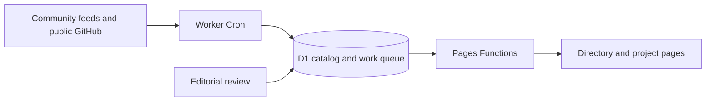

# JevHunt

A public directory of Jev applications, integrations, SDKs, local alternatives and research. Live at **https://jevhunt.com**.

Every listing has a relationship label, source evidence and freshness information. Documentation or a source-code reference is not a runtime test. Coverage is limited to the discovery sources and searches recorded in `/catalog-audit.json`.

## Development

Node 24 and Python 3.12 are used in CI. The frontend is plain JavaScript, HTML and CSS; Cloudflare Pages Functions use D1 for Google sessions and submissions.

```sh
npm ci
npm run build
npm run db:migrate:local
npm run dev
```

Copy `.dev.vars.example` to `.dev.vars` for local Google OAuth credentials and optional administrator access. The registered local callback is `http://localhost:8788/api/auth/callback`. Browsing works without authentication. Production Google credentials are encrypted Pages secrets; do not put them in Git or client-side assets.

```sh
npm test
pip install -r requirements-examples.txt
npm run test:examples
npx wrangler pages functions build functions --outdir=.cache/functions
```

The Python example tests use the actual SDK and an offline HTTP transport. They make no billable model calls. The DOM tests simulate interactions, storage failures, search and pagination without operating a browser.

## Live catalog and scheduled updates

The data path runs entirely in Cloudflare:



`workers/catalog-sync` uses a persistent Cloudflare Durable Object alarm to advance a small batch every minute. Cron Triggers also wake and repair the clock. The first site request starts the clock if necessary; startup is idempotent. Community feeds refresh every six hours. Paginated GitHub searches and repository checks continue between feed updates, with persisted cursors, retry times and a lease that prevents overlapping batches. Existing repositories are rechecked continuously; individual evidence and metadata check dates are shown on their pages.

The worker reads public GitHub repository metadata and commit-pinned source evidence. It does not store an account-wide Cloudflare token or a GitHub publishing credential. GitHub is used for source control, CI and public repository data; committing catalog data is not part of the live update path.

`catalog/sources.json` configures two independent community sources, an official repository allowlist and GitHub discovery queries. The checked-in `public/catalog.json` is an initial/fallback snapshot. The live API, homepage rendering, project pages, category pages and sitemap read D1, so newly discovered projects appear without rebuilding the site.

Local bootstrap tools remain available:

```sh
npm run catalog:sync              # authenticated gh or GITHUB_TOKEN, for a full local audit
npm run catalog:seed:local        # insert missing initial records into local D1
npm run catalog:seed:remote       # insert-only; preserves newer worker/editor records
```

`npm run catalog:sync -- --skip-search` refreshes known repositories and community feeds while retaining previous search provenance. `--accept-policy-change` is only for an editor-approved large reduction after inspecting `.cache/proposed-catalog.json`; automatic updates retain old data when checks fail.

The shared evidence policy distinguishes:

- **Official:** an allowlisted TypeSafe SDK/resource.
- **Documented:** a first-party usage statement or API/SDK reference.
- **Code reference:** an API identifier found in source, linked at a fixed commit.
- **Editor reviewed:** a human-approved source reference and classification.
- **Needs review:** retained historical data awaiting a successful check.

Local alternatives, research and directories are separate from applications that call Jev. Negative statements, image badges, bare recommendation links and downstream-user lists do not establish integration evidence. Stars measure the whole repository.

Editorial corrections belong in `catalog/overrides.json`; `codePaths` can point to an integration that is absent from the README. Transient failures keep published data and schedule a retry. Repeatedly unreachable repositories leave the active directory but retain a tombstone. An automatic removal floor prevents an unexpected mass disappearance.

Inspect `/status/`, `/api/catalog/status` and `/api/health` for source results, queued work, recent runs and the **real scheduled heartbeat (including durable alarms)**. Manual test runs do not fake that heartbeat. `/catalog.json` exports current public project data, and `/api/catalog?all=1` provides the compact browser index.

## Build and discovery pages

`npm run build` generates:

- Nine localized landing pages with canonical/hreflang metadata and a prerendered first page.
- One small language bundle per locale and a 20-entry initial catalog. The complete search index loads on interaction.
- `/projects/<owner>/<repo>/` with facts, evidence, related projects and source links.
- Crawlable `/browse/` and `/categories/<category>/` pagination, a complete sitemap, and redirects for known repository renames.
- `/methodology/`, `/status/`, and the private-use `/admin/` interface (noindex; access is checked by the API).
- `/build-info.json`, containing the source commit, catalog identity and hashes used to verify a release.

Generated static pages are fallback artifacts. Pages Functions render the live homepage, project details, category pagination, status and sitemap from D1. The code build and the live catalog each have their own version. `tools/stamp.mjs` versions assets and the imported catalog-state module to match the long cache lifetime.

Search, category, project type, language, archival state, sort order and loaded page count persist in the URL. Locale switching preserves this state.

## Submission and editorial workflow

Google sign-in requires a verified email. Accounts are keyed by Google's stable subject; matching emails cannot rebind another account. Session lifetime is a fixed 30 days, matching the cookie. OAuth states are consumed atomically, and post-login redirects are restricted to the current origin.

Submissions require an authenticated same-origin JSON request, canonical GitHub repository URL, category and consent. Input size/type limits are enforced server-side. A single SQL statement enforces the five-per-hour quota and active-submission duplicate checks.

Configure the `ADMIN_EMAILS` encrypted Pages secret with a comma-separated list of authorized Google account emails, then sign in at `/admin/`. The queue uses cursor pagination so reviewing entries cannot skip later submissions. Approval requires a source URL pinned to a 40-character commit, a category, a relationship and a review note. Concurrent edits return a conflict.

`GET /api/catalog-submissions` exports approved public fields and withdrawn repository identifiers without submitter identities or private notes. D1 triggers atomically queue approved projects for the worker. Withdrawing a previously approved listing immediately excludes it from live queries and blocks rediscovery; approval removes the block. Rejected, never-approved submissions remain private. The administrator can also queue a discovery refresh through a private Worker service binding.

Database changes are additive and versioned under `migrations/`:

```sh
npm run db:migrate:local
npm run db:migrate:remote
```

The original production tables were created before migration tracking. Migration 0001 uses `IF NOT EXISTS`, so the migrations runner can adopt that database safely.

## Deploying code

The Pages frontend and the private scheduler Worker share the existing D1 database. One SQLite Durable Object stores the timer; job progress and catalog records remain in D1. The worker has no public workers.dev or preview URL. Its manual endpoint is accessible through an administrator-authenticated Pages API and a private service binding.

Authenticate Wrangler once on the deployment machine. Keep the Google OAuth secret and `ADMIN_EMAILS` in encrypted Pages secrets:

```sh
npx wrangler login
npx wrangler pages secret put GOOGLE_CLIENT_SECRET --project-name jevhunt
npx wrangler pages secret put ADMIN_EMAILS --project-name jevhunt
npm run deploy
```

`npm run deploy` builds and tests the site, applies additive database migrations, inserts missing bootstrap records, deploys the scheduled Worker, deploys Pages and verifies production. Updates after this initial release run automatically inside Cloudflare. No GitHub Actions deployment secret is required.

The existing public client ID and D1 binding are in `wrangler.toml`. Pages does not accept `account_id` in that file; use the environment if multiple Cloudflare accounts are available. The scheduler config is `workers/catalog-sync/wrangler.toml`.

Cloudflare can take several minutes to propagate a new Cron Trigger. Production verification requires a recent **automatic timer** invocation, a successful source check, the expected code build, live server-rendered catalog data, working D1, anonymous admin denial, logout cookie cleanup and a real 404. A deployment command returning success alone is not sufficient.

CI on pull requests and code branches builds the fallback artifacts, checks behavior and schema, validates the real SDK examples offline, and compiles both the Pages Functions and the Worker. CI does not publish catalog updates.

For local UI/API work:

```sh
npm run db:migrate:local
npm run catalog:seed:local
npx wrangler pages dev public --port 8788
```

Test the scheduler in a separate local sandbox. Two independent `workerd` processes must not open the same SQLite persistence files:

```sh
npx wrangler d1 migrations apply jevhunt-db --local --persist-to .cache/scheduler-state
node tools/seed-catalog.mjs --persist-to .cache/scheduler-state
npx wrangler dev --config workers/catalog-sync/wrangler.toml --port 8790 --persist-to .cache/scheduler-state --test-scheduled
```

`POST /start` arms the local durable timer; `POST /tick` advances a manual batch. `/__scheduled` tests Cron wake-up. Unit tests use isolated in-memory D1 databases. Use a Cloudflare preview deployment for the full shared-D1 integration test.

On a production incident, Pages deployment history can restore the previous code build. Worker versions can also be rolled back. Catalog data and retry cursors persist in D1; all schema changes are additive and the bootstrap is insert-only.

## Known scope

The directory covers discoverable public GitHub projects. It does not certify installation, security, performance, license compatibility, or the truth of every author claim. A public repository without a stated license is labeled accordingly. Source evidence and relationship labels make those limits inspectable.

JevHunt is independent and is not affiliated with TypeSafe AI. Product names belong to their respective owners.
